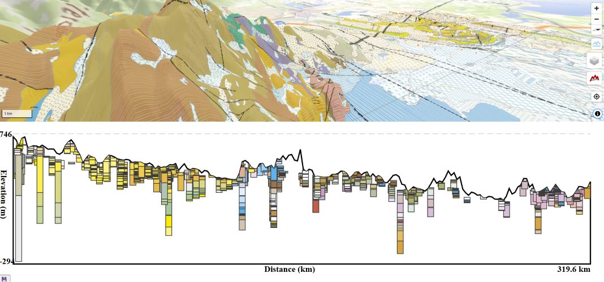

GEO3-BY: 3D Geological map and Drill core profiles for Bayern-DE

https://filippeof.github.io/geo-by/

- Data sources:
  - Geological map, Drill core data 
    - Bayerisches Landesamt für Umwelt, www.lfu.bayern.de; Lizenz: CC BY 4.0
  - Elevation data, Base maps
    - Geobasisdaten: Bayerische Vermessungsverwaltung – www.geodaten.bayern.de (Daten verändert), Lizenz: CC BY 4.0, © GeoBasis-DE / BKG 2022 (Daten verändert)
  - OSM basemap
    - © OpenStreetMap contributors

- JS libs:
  - Maplibre [https://github.com/maplibre/maplibre-gl-js/]
    - MapLibre COG Protocol [https://github.com/geomatico/maplibre-cog-protocol]
  - Turf [https://github.com/Turfjs/turf]
